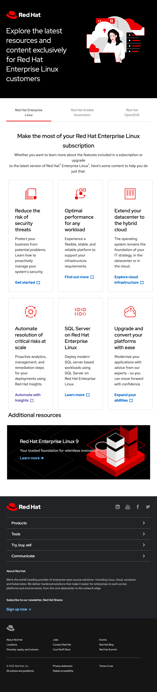

# Red Hat Design System Demo

[Preview](https://rollup-rhds-demo.vercel.app/)



This repo serves as an example of how you can use [Rollup](https://rollupjs.org/guide/en/) to create a custom bundle for your components.

## Usage

```
npm run build
```

This will generate the following two files.

```bash
dist/bundle.js
dist/bundle.css
```

You can then import those files.

```html
<!DOCTYPE html>
<head>
	<link href="dist/bundle.css" rel="stylesheet" />
</head>
<body>

  <script type="module" src="./dist/bundle.js"></script>
</body>
</html>
```


## Updating Dependencies

Add dependency to `package.json`

`package.json`
```json
{
  ...
  "dependencies": {
    "@patternfly/pfe-accordion": "^1.12.3",
    "@patternfly/pfe-band": "^1.12.3",
    "@patternfly/pfe-card": "^1.12.3",
    "@patternfly/pfe-cta": "^1.12.3",
    "@patternfly/pfe-jump-links": "^1.12.3",
    "@patternfly/pfe-navigation": "^1.12.3",
    "@patternfly/pfe-select": "^1.12.3",
    "@patternfly/pfe-styles": "^1.12.3",
    "@patternfly/pfe-tabs": "^1.12.3",
    "@patternfly/pfelement": "^1.12.3",
    "@rhds/elements": "^1.0.0-beta.23"
  }
}
```

Import your dependency to the bundle entrypoint, `bundle.js`.

`bundle.js`
```js
import '@patternfly/pfe-band/dist/pfe-band.js';
import '@patternfly/pfe-tabs/dist/pfe-tabs.js';
import '@patternfly/pfe-card/dist/pfe-card.js';
import '@rhds/elements/rh-footer/rh-footer-lightdom.css';
import '@rhds/elements/rh-footer/rh-footer.js';
import '@rhds/elements/rh-cta/rh-cta.js';
import '@rhds/elements/rh-footer/rh-footer-lightdom.css';
import '@patternfly/pfe-styles/dist/pfe-base.css';
import '@patternfly/pfe-styles/dist/pfe-layouts.css';
import './tweaks.css';
```

## Patches

[Patch-Package](https://www.npmjs.com/package/patch-package) is used to automatically apply an changes to the node_modules dependencies.
The patches are defined in the `patches` directory.  They are automatically applied after `npm install` has completed.

## Proxy

To preview changes on the live site we use the [spandx](https://www.npmjs.com/package/spandx) tool.  This does the following:

1. Starts a proxy web server.
2. Dynamically adds files in the `dist` directory.
3. Dynamically replaces the existing footer with <rh-footer>

### Start Proxy Server

```bash
npm run proxy
```
